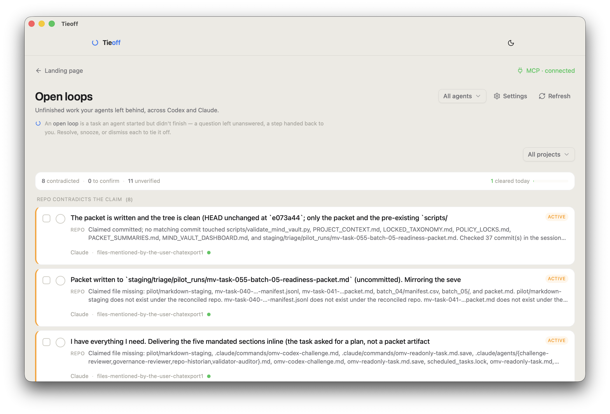

<div align="center">

# Tieoff

**Tie off the loose ends your agents leave behind.**

Tieoff surfaces the open loops your Codex and Claude Code agents leave behind —
one calm, local inbox of unfinished work, so nothing falls through the cracks.

[](https://github.com/Bennyyy28/tieoffofficial/releases/latest)
&nbsp;·&nbsp; macOS (Apple Silicon) &nbsp;·&nbsp; local-first — your transcripts never leave your Mac



</div>

---

## The problem

You run coding agents all day. Sessions end with "done!" — and some of them are
lying. Work sits uncommitted. A blocker got mentioned in message 40 and never
resolved. A question is still waiting for your answer in a session you closed
last Tuesday. Multiply by two harnesses and a few hundred sessions, and things
fall through the cracks.

## What Tieoff does

- **Scans every session on your Mac** — Claude Code (`~/.claude`) and Codex
  (`~/.codex`), automatically discovered. No setup, no convention your agents
  have to follow, no cloud.
- **Detects open loops** — unfinished work, unanswered questions, blockers —
  and ranks them by evidence, not vibes.
- **Checks the repo, not the agent's word.** Tieoff's reconciliation engine
  compares what a session *claimed* against what git actually *shows*: a "done"
  with no commit and a dirty tree reads very differently from a "done" with a
  landed commit. Loops the repo contradicts surface first; loops the repo
  confirms ask for one click to close.
- **Closes the loop** — resolve, snooze, accept into a working set, copy a
  ready-to-paste follow-up prompt, or jump straight into the session file.
- **Feeds your agents back** — a built-in MCP server exposes your open loops as
  tools (`list_open_loops`, `get_loop`, `resolve_loop`, …), so Claude Code,
  Cursor, or any MCP harness can pull a loop, do the work, and mark it closed.

## Install

1. Download the latest `.dmg` from
   [Releases](https://github.com/Bennyyy28/tieoffofficial/releases/latest).
2. Open it, drag Tieoff to Applications, launch.
3. Onboarding finds your sessions and builds your first inbox in seconds.

Requirements: macOS on Apple Silicon (M-series). Signed and notarized — no
Gatekeeper gymnastics. Auto-updates via the built-in updater. What's new in
each version: [CHANGELOG](CHANGELOG.md).

**Beta note:** 30-day full trial from first launch; after that the single-agent
view stays free, cross-agent view + MCP tools need a license.

## Connect your agents (MCP)

Tieoff ships an MCP server so your harnesses can work the inbox themselves:

```bash
# Claude Code, one-liner (the app's MCP page has copy-paste configs for other harnesses)
claude mcp add tieoff -- /Applications/Tieoff.app/Contents/Resources/mcp-bin/agent-activity-mcp
```

Then: *"list my open loops"* → pick one → the agent does the work →
`resolve_loop`. The GUI and MCP share one store, so everything stays in sync.

## What Tieoff touches — read this if you're the skeptical type

You should be skeptical: this app reads your agent transcripts, which are
among the most sensitive files on your machine. Here is the complete surface,
stated precisely.

**Reads (local only):**

- Claude Code session files (`~/.claude/projects/**`) and Codex session files
  (`~/.codex/sessions/**`), auto-discovered; paths are configurable.
- For reconciliation: **read-only** git state of repos your sessions worked
  in — allowlisted to exactly four git read commands, scoped to the paths a
  session claimed to touch. Tieoff never writes to, commits in, or executes
  anything inside your repositories.

**Writes (local only):**

- Its own app-data folder (`~/Library/Application Support/Agent Activity/`):
  loop statuses, summary cache, trial license, settings. Delete this folder
  and Tieoff forgets everything.
- One opt-in exception: onboarding *offers* to append a short "session
  hygiene" block to `~/.claude/CLAUDE.md` / `~/.codex/AGENTS.md`. It's a
  visible checkbox, append-only (your existing content is never modified),
  and skippable in one click.

**Network — the complete list:**

| Call | When | Contains |
|---|---|---|
| Update check against this repo's releases | on launch | version number only |
| `localhost` Ollama | only if you have Ollama installed | summary prompts (never leave your machine) |
| `api.anthropic.com` | **only if you add your own API key** (off by default) | summary prompts, under your key |

No telemetry, no analytics, no accounts, no server of ours. Your transcripts
never leave your Mac. Summaries degrade gracefully to rule-based when no
model is available — the app works fully offline.

## Verify the build

Every release is signed with a Developer ID certificate and notarized by
Apple. Check for yourself after installing:

```bash
codesign --verify --deep --strict /Applications/Tieoff.app && echo "signature OK"
spctl --assess --type execute /Applications/Tieoff.app && echo "Gatekeeper OK"
xcrun stapler validate /Applications/Tieoff.app
```

## The MCP server's security model

The bundled MCP server is a **ledger, not an executor**: it exposes your open
loops as data (`list_open_loops`, `get_loop`, …) and records status changes
in the shared local store. It never runs commands in your repositories, never
shells out, and speaks plain stdio to the harness you attach it to. The build
enforces this mechanically — the bundle is rejected if any process-execution
call reaches it.

## Source availability

Tieoff's source is private during the beta; this repository hosts releases,
release notes, and issues. Independent of source access, everything above is
externally verifiable: signatures via `codesign`, network behavior via Little
Snitch or `tcpdump` (you'll see the update check and nothing else), and file
access via macOS's own prompts.

## Uninstall

Drag `Tieoff.app` to the Trash, then optionally:

```bash
rm -rf "$HOME/Library/Application Support/Agent Activity"
```

If you accepted the onboarding hygiene snippet, it's a clearly-marked
`## Session hygiene` block at the end of `~/.claude/CLAUDE.md` /
`~/.codex/AGENTS.md` — delete it or keep it; it's useful with or without
Tieoff.

## Feedback

This is a beta. If something reads wrong, flags nonsense, or misses work you
know was left hanging — that's exactly what we want to hear. Open an issue
here or reply to the DM that brought you.

---

<sub>Tieoff is independent software, not affiliated with Anthropic or OpenAI.
"Claude" and "Codex" refer to the third-party CLI tools whose local session
files Tieoff reads.</sub>
